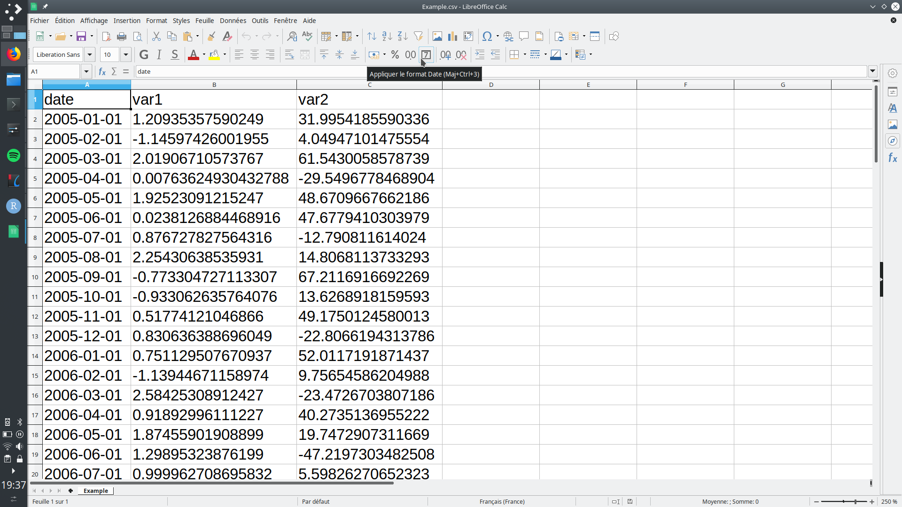

# Welcome in the shiny demo app of the autoTS package !

This app is meant to allow you to make predictions of univarate time series with the help of the [autoTS package](https://github.com/vivienroussez/autoTS) for R.

To be able to use this App, all you need is to prepare is CSV file containing one column for the dates of your time series and one column per time series.
If the shape of your original data does not fit that format, you can of course use the `tidyr::spread()` function ! The dates should be compatible with the `lubridate` package (numerous formats available !)

Please see the documentation of the package (link above) for more information about how the training of the algorithms and the predictions are made.

This interface allows you to check quickly whether the implemented algorithms may fit your data or not.

## Expected shape of the CSV file 
